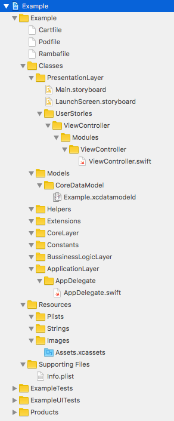
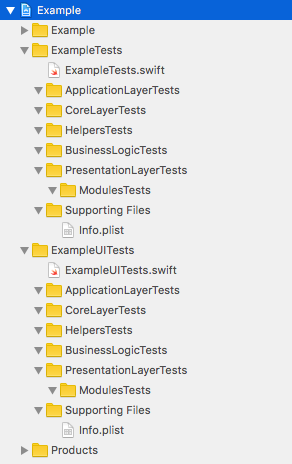

# Xcode project template

### Project template with convinient structure which was borrowed from [rambler-it-ios project](https://github.com/rambler-digital-solutions/rambler-it-ios)

#### Project settings window:

#### Swift project structure:

Tests structure:

#### Objective-C project structure:

Tests structure:

### Installation:
1. Create empty folder `__empty` in `Templates` folder
2. Put template to `~/Library/Developer/Xcode/Templates`

### TO-DO:

* Fix path for modules in Unit tests and UI tests folders
* Put test file into correct folder
* Put ui test file into correct folder
